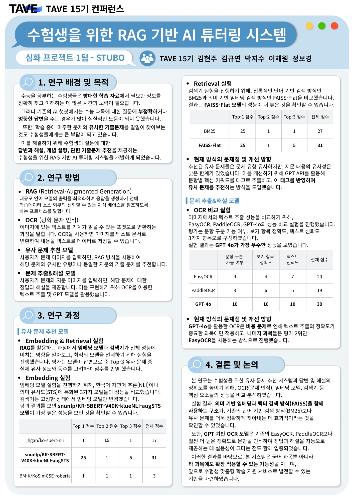

# 📚 STUBO: 수험생을 위한 RAG 기반 AI 튜터링 시스템

**이미지 기반 수능 국어 문제 자동 분석 및 튜터링 서비스**

> **STUBO**는 문학, 비문학, 화법과 작문, 언어와 매체 영역의 국어 지문/문제 이미지를 업로드하면  
> OCR → 문제 해석 → 정답/해설 생성 → 유사 문제 추천까지 자동으로 수행하는 AI 튜터링 시스템입니다.

---

## 📌 프로젝트 개요

- **주제:** RAG 기반 국어 문제 풀이 및 유사 기출 문제 추천 시스템 개발
- **목표:**  
  - 국어 지문 및 문제 이미지 기반 자동 분석 및 설명 제공
  - 질문에 대해 정답 및 해설, 유사 기출 문제, 출처 정보까지 통합 제공
  - 과목별로 최적화된 파이프라인을 구축하여 성능 비교 및 통합 운영
  - Streamlit 기반 직관적인 웹 UI 제공

---

## 🙌 STUBO 팀원 소개

| 이름 | 역할 |
|------|------|
| 김현주 | 팀장 / 문학 파이프라인 담당 |
| 김규연 | 비문학 파이프라인 담당 |
| 이채원 | 화법과 작문 파이프라인 담당 |
| 박지수 | 언어와 매체 담당 |
| 정보경 | 언어와 매체 담당 |

---

## 🔍 핵심 기능

### 1. 📚 과목별 맞춤 파이프라인 제공
- `문학` / `비문학` / `화법과 작문`/`언어와 매체` 중 과목 선택
- 각 과목에 최적화된 파이프라인 모듈 실행  
  - 문학: GPT-4o 기반 OCR 정교화 + LangChain RAG  
  - 비문학: EasyOCR + GPT 태깅 + 임베딩 기반 유사도 비교  
  - 화법과 작문: EasyOCR + GPT 질의 + FAISS 기반 유사 문제 추천

### 2. 🖼️ 이미지 기반 문제 분석 (GPT-4o Vision)
- 지문/문제 이미지 업로드 시 GPT-4o Vision을 통해 원문 그대로 텍스트 추출
- 문단 구조/특수기호/강조 표시까지 복원

### 3. 🧠 정답 및 해설 자동 생성
- LLM 기반 문제 분석 및 고품질 해설 생성
- 문학은 `<보기>`와 지문 분석을 통한 논리적 해설 제공

### 4. 🔁 유사 문제 추천
- 문학: GPT 기반 문제 태깅 + 벡터 유사도 + 태그 유사도 결합
- 비문학: 키워드 기반 임베딩 유사도 계산
- 화법과 작문: 문제 내용 기반 FAISS 검색 + OCR 정답/해설 매칭

### 5. 🌐 사용자 친화적 UI (Streamlit)
- 이미지 업로드, 과목 선택, 유사 문제 수 조절
- 분석 결과를 직관적으로 확인 가능

---

## 📂 프로젝트 구조

STUBO/
├── Streamlit_App.ipynb # 메인 웹 인터페이스 (Streamlit)
├── pipeline/
│ ├── pipeline_literature.py # 문학 전용 파이프라인
│ ├── pipeline_non_literature.py # 비문학 전용 파이프라인
│ ├── pipeline_speechcomp.py # 화법과 작문 전용 파이프라인
│ └── utils.py # 공통 유틸 함수
├── data/
│ ├── corpus.json # 전체 기출 문제 데이터셋
│ ├── faiss_index/ # 문학/비문학/화작별 벡터 인덱스
│ └── output_images/ # OCR 대상 이미지 파일
├── assets/ # 예시 이미지 및 결과
└── README.md

---

## 🌟 기대 효과

- 수험생이 **혼자서도 문제를 깊이 있게 학습 가능** 
- 단순 정답 제공을 넘어, **논리적 근거 기반 해설 제공**
- 문제 유형 분석 + 유사 기출 문제까지 연계해 **효율적인 문제 풀이 학습 구조 확보**

---

## 📊 모델 성능 실험 결과

  

---

## 🛠️ 기술 스택

| 영역         | 사용 기술 |
|--------------|-----------|
| OCR          | GPT-4o (Vision), EasyOCR |
| LLM          | GPT-4o, GPT-4o-mini |
| 유사도 검색  | FAISS, SentenceTransformers |
| 벡터 QA      | LangChain RetrievalQA |
| 프론트엔드   | Streamlit |
| 백엔드       | Python 3.10+ |

---

## 🖼️ 사용 예시

1. **문제 이미지 업로드**
   - 국어 문제 스캔 이미지 선택
  
2. **과목 선택 (문학/비문학/화법과 작문/언어와 매체)**
  
3. **자동 분석 결과 확인**
   - OCR 복원 결과
   - 정답 및 해설
   - 유사 기출 문제 추천 (문제 이미지 포함)
---

## 🔮 향후 발전 방향

- 영어, 수학 등 타 수능 과목으로 확장
- 사용자 로그 기반 개인 맞춤형 학습 추천 기능 강화
- GPT-4o 기반 멀티모달 튜터링 개선 및 학습 이력 관리 기능 추가
- OCR이 불완전할 경우 재업로우 요청 메시지 출력 기능 추가
- 모바일 인터페이스 최적화

---

